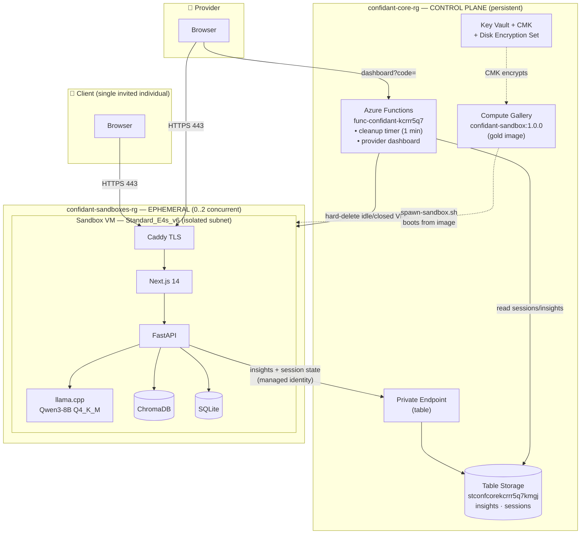
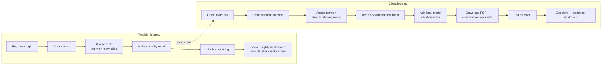

# Solution Architecture Document (SAD) — Confidant

**Product:** Confidant — Sovereign AI Sandbox
**Version:** 2.0 · **Date:** 2026-07-19 · **Status:** Deployed & acceptance-tested
**Environment:** Azure subscription *goneset* (`0f94670d-1eff-45a0-a2f8-8215eb135886`), West Europe
**Related docs:** [SPEC.md](SPEC.md) · [HANDOFF.md](HANDOFF.md) · [ARCHITECTURE.md](ARCHITECTURE.md) · [DOCS_UPDATE_TRACE.md](DOCS_UPDATE_TRACE.md)

---

## 1. High-Level Solution Overview

### 1.1 Purpose
Confidant lets a **provider** (clinic, bank, advisory firm) hand a single **client** a private, disposable AI workspace tied to a specific document and to the provider's expertise. The client reads the document and asks a **local** AI model questions; no data is ever sent to an external LLM provider, and the entire workspace is destroyed when the engagement ends.

### 1.2 Business value
| Driver | How Confidant delivers |
|---|---|
| **Data sovereignty as a sellable promise** | The model runs on an isolated VM with no outbound internet; the VM is provably destroyed. The pitch is physical, not just contractual. |
| **Regulated-industry fit** | Health/finance clients who cannot feed documents into public AI get an auditable, in-tenant alternative. |
| **Client-facing self-service** | A client answers their own questions 24/7 against the exact document and the provider's knowledge base, reducing back-and-forth. |
| **Demand intelligence** | The provider gets a persistent, anonymized dashboard of what clients actually worry about — sharpening sales and service — without seeing personal data (unless the client opts in). |

### 1.3 Core objectives
1. **Sovereign inference** — 100% local model per engagement; no external LLM egress.
2. **Ephemerality** — one VM per client; automatic hard-deletion on session close or 15-minute inactivity.
3. **Persistent, privacy-preserving insight** — high-level topic analytics survive VM destruction; personal content only with explicit consent.
4. **Cost control** — near-zero idle cost; sandboxes billed only while a client is active; one-command teardown.
5. **Fast, self-service UX** — invite → verify → read/ask/download in minutes.

### 1.4 Scope (v2)
**In:** single-client PDF sandboxes (≤200 pages), local RAG Q&A with citations, document view/download + conversation-summary appendix, consent-based sharing, anonymized provider dashboard, full spin-up/tear-down automation.
**Out (v2):** multi-client rooms, persistent provider identity across sandboxes, GPU inference, mobile-native apps, custom-domain/branded email (deliverability open item).

---

## 2. Technical Architecture

### 2.1 Topology — two planes
A **persistent control plane** (cheap, always-on) orchestrates and outlives many **ephemeral sandboxes** (one per client engagement).



### 2.2 Cloud infrastructure inventory
| Plane | Resource | Name / SKU | Role |
|---|---|---|---|
| Control | Resource group | `confidant-core-rg` | Persistent platform |
| Control | Storage + tables | `stconfcorekcrrr5q7kmgj` (Standard_LRS; tables `insights`, `sessions`) | Analytics + session state; **Entra-RBAC-only** (shared-key disabled) |
| Control | Private endpoint + DNS | `pe-...-table` + `privatelink.table.core.windows.net` | In-VNet table access |
| Control | Function app | `func-confidant-kcrrr5q7` (Linux Y1, Python 3.12, system MI) | Cleanup timer + dashboard |
| Control | Key Vault / key / DES | `kv-conf-kcrrr5q7kmgj` / `cmk-gallery` (RSA-3072) / `des-confidant-gallery` | Customer-managed encryption |
| Control | Compute Gallery | `confidant_gallery/confidant-sandbox:1.0.0` (Gen2, CMK) | Gold master image |
| Control | VNet | `vnet-confidant-core` 10.20.0.0/16 (`snet-sandbox`, `snet-endpoints`) | Network isolation |
| Sandbox | Resource group | `confidant-sandboxes-rg` | Holds live sandboxes (empty when idle) |
| Sandbox | VM (per client) | `vm-confidant-<id>` — `Standard_E4s_v6` (4 vCPU/32 GB), CMK Premium OS disk `deleteOption: Delete` | Runs the whole app + local model |
| Sandbox | NSG | `nsg-sandbox` | Inbound 443 only; outbound denied except DNS+ACME |
| Landing | Resource group | `confidant-landingpage-rg` | `goneset-swa` + `confidant-acs` |
| Legacy | Resource group | `confidant-rg` | `confidant-email` (unmovable EmailServices) |

### 2.3 Application stack (inside each sandbox)
| Layer | Technology |
|---|---|
| Reverse proxy / TLS | Caddy 2 (automatic ACME on the VM FQDN) |
| Frontend | Next.js 14 · TypeScript · Tailwind (built same-origin) |
| Backend | FastAPI · Python 3.12 · SQLAlchemy |
| Vector store | ChromaDB (persistent, local) · all-MiniLM-L6-v2 embeddings |
| LLM runtime | llama.cpp server · Qwen3-8B Q4_K_M GGUF · `-t 4 --mlock --ctx-size 8192` |
| Relational store | SQLite (rooms, members, documents, audit, qa_insights, session_activity) |
| Doc processing | pypdf (extraction + page count) · reportlab (appendix) |
| Auth | JWT (provider) · URL-safe session tokens (client) |

### 2.4 Third-party / platform integrations
- **Azure Communication Services** (`confidant-acs` + `confidant-email`) — verification-code email (`azure-communication-email`). *Deliverability is an open item.*
- **Azure Table Storage** — insights + session mirror via `azure-data-tables` + `DefaultAzureCredential` (managed identity).
- **Azure Compute Gallery + CMK** — immutable, encrypted gold image; no runtime weight fetches.
- **Optional external LLM** — Anthropic API or OpenAI-compatible Foundry endpoint via config switch (not the default).

---

## 3. Data Flow & System Integration

### 3.1 Engagement lifecycle (spawn → destroy)
```mermaid
sequenceDiagram
    actor Op as Operator/Provider
    participant SH as spawn-sandbox.sh
    participant AZ as Azure ARM
    participant IMG as Gold Image
    participant VM as Sandbox VM
    participant TBL as Table Storage
    participant FN as Cleanup Function

    Op->>SH: spawn-sandbox.sh <client-id>
    SH->>SH: gen SECRET_KEY; fetch ACS creds
    SH->>AZ: deploy sandbox.bicep (customData=runtime.env)
    AZ->>IMG: clone CMK gold image
    IMG->>VM: boot; confidant.service reads runtime.env
    VM->>VM: docker compose up (no downloads); Caddy ACME
    Note over VM: HTTPS answering in ~5-6 min
    VM-->>TBL: session_activity upsert (status=active)
    loop every 60s while used
        VM-->>TBL: last_activity heartbeat
    end
    Op-->>VM: (client works: read/ask/download)
    alt Client ends session
        VM->>TBL: status=closed (POST /session/close)
    else 15-min inactivity
        Note over TBL: last_activity ages out
    end
    FN->>TBL: read sessions (every 1 min)
    FN->>AZ: delete VM+NIC+PIP+disk
    FN->>TBL: status=deleted (insights retained)
```

### 3.2 Q&A request flow (fully local)
```mermaid
sequenceDiagram
    actor C as Client
    participant BE as FastAPI
    participant CH as ChromaDB
    participant LL as llama.cpp
    participant BG as BackgroundTask
    participant TBL as Table Storage

    C->>BE: POST /api/rooms/{id}/qa (session token)
    BE->>CH: embed query; retrieve top-k (room + knowledge)
    CH-->>BE: ranked chunks
    BE->>LL: prompt + context (OpenAI /v1, local)
    LL-->>BE: answer with [N] markers
    BE->>BE: ground answer (keep cited sources; flag if ungrounded)
    BE-->>C: {answer, citations, grounded}
    BE->>BG: classify question (category + PII-free topic)
    BG->>LL: classify
    BG->>TBL: insights row (text only if sharing=full)
```

### 3.3 Communication protocols & endpoints
- **Client/Provider ↔ Sandbox:** HTTPS 443 only (Caddy TLS). REST/JSON; multipart for uploads; PDF blob for file downloads.
- **Sandbox ↔ Table Storage:** HTTPS via private endpoint, `DefaultAzureCredential` (managed identity), no keys.
- **Provider ↔ Dashboard:** HTTPS to Function app, function-key (`?code=`) protected.
- **Intra-VM:** Docker bridge network; backend ↔ llama.cpp over `http://llamacpp:8080/v1`.
- **Key REST endpoints:** see [SPEC.md §3](SPEC.md); dashboard: `GET /api/dashboard`, `GET /api/dashboard-data`.

### 3.4 Data classification & residency
| Data | Store | Residency | Lifecycle |
|---|---|---|---|
| Document (PDF), vector index, chat | Sandbox VM disk (SQLite/Chroma/fs) | On VM only | Destroyed with VM |
| Anonymized topic + category | Table `insights` | Control plane (West Europe) | Persists |
| Full question/answer text | Table `insights` | Control plane | Persists **only if client opted into full sharing** |
| Session heartbeat/state | Table `sessions` | Control plane | Persists (marked `deleted`) |
| Model weights | Gold image (CMK) | Azure tenant | Immutable |

---

## 4. UX & Functional Architecture

### 4.1 End-to-end user journeys


### 4.2 Interface map (routes → purpose → backend triggers)
| Surface | Route | User action → backend event |
|---|---|---|
| Landing | `/` | Marketing; entry to login |
| Provider auth | `/login` | register/login → JWT |
| Provider dashboard | `/dashboard` | list/create rooms; link to `/insights` |
| Room mgmt | `/dashboard/rooms/[roomId]` | upload PDF (`POST .../documents`), invite (`POST .../invites`), audit (`GET .../audit`) |
| Insights | `/insights` | `GET /api/insights` → charts |
| Client join | `/join/[token]` | verify (`/verify`,`/confirm`) → accept + sharing (`/accept`) |
| Client room | `/room/[roomId]` | view/download (`.../file[?with_appendix=1]`), ask (`/qa`), change sharing (`/sharing-mode`), end (`/session/close`) |
| Provider (control plane) | Function `/api/dashboard` | server-rendered analytics HTML |

### 4.3 Key interaction patterns
- **Document viewer:** auth'd `fetch` → blob → object URL → `<iframe>` (headers can't ride an `iframe src`).
- **Sharing consent:** two-radio step at accept; anonymized default; discreet in-chat toggle; every change audited.
- **End Session:** explicit button (confirm → goodbye screen) **and** `navigator.sendBeacon` on `pagehide` (survives CORS preflight via `text/plain`).
- **Sovereignty signaling:** persistent "Local model · qwen3-8b — data never leaves the sandbox" badge.
- **Charts:** plain SVG/Tailwind (no charting library), light/dark friendly.

---

## 5. Non-Functional Requirements (NFRs)

### 5.1 Security
| Control | Implementation |
|---|---|
| Network isolation | Sandbox NSG: inbound 443 only; outbound denied except Azure DNS + ACME; VM↔VM blocked |
| No external LLM egress | Local llama.cpp; weights baked into image; no runtime fetches |
| Encryption at rest | CMK (Key Vault RSA-3072) on gold image + sandbox OS disk; TLS 1.2 + HTTPS-only storage |
| Storage data plane | Entra-RBAC only (`allowSharedKeyAccess=false`); managed identity; private endpoint for in-VNet |
| Least-privilege RBAC | Function MI scoped to VM/Network Contributor on sandboxes RG + Table Data Contributor on core storage |
| Auth | JWT (provider, bcrypt passwords, password policy); URL-safe session tokens with TTL (client) |
| Input hardening | PDF-only + size/page caps; filename sanitization; rate limiting; code TTL + attempt cap + one-time use |
| Secrets | Per-sandbox `SECRET_KEY` generated at spawn; injected via cloud-init; never baked into the image |
| Auditability | Append-only audit log (views, downloads, questions, governance, session close) |

### 5.2 Availability & resiliency
- **Sandbox:** single-VM, single-user, ephemeral by design — no HA target; failure → re-spawn (~5–6 min from gold image).
- **Control plane:** Azure Functions + Table Storage (LRS) managed availability; cleanup timer is idempotent and self-healing (missed runs caught next minute; VM-absent → mark deleted).
- **Insight durability:** analytics mirrored off-VM before destruction; survive sandbox loss.
- **Cost-safety:** automatic destruction bounds runaway spend even if a client abandons a session.

### 5.3 Performance
| Metric | Target / observed |
|---|---|
| Spawn → HTTPS answering | ~5–6 min (no runtime downloads) |
| Q&A latency (local, 4 vCPU) | ~8 tok/s generation; ~25 s for a cited multi-part answer (observed in e2e) |
| Cleanup latency | ≤ ~90 s after session close (1-min timer + delete) |
| Document limits | PDF ≤ 200 pages, ≤ 50 MB |

### 5.4 Scalability
- **Concurrency:** max 2 sandboxes today (10-vCPU regional cap ÷ 4 vCPU); raise via quota.
- **Horizontal model:** one VM per client — scales by spawning more, not bigger; naturally multi-tenant-isolated (no shared runtime).
- **Upgrade levers:** GPU SKU (NCASv3_T4) for faster/larger models; `E4ds_v6` ephemeral-OS-disk variant; larger gold-image model versions published as new gallery versions.

### 5.5 Cost (West Europe, approx.)
| State | Cost |
|---|---|
| Control plane idle | ~€7.5/mo (private endpoint €6.8; rest <€1) — or ~€0.7/mo without the PE |
| Active sandbox | ~€0.29/h (VM + Premium disk + PIP), billed only while alive |
| Fully torn down | €0 (rebuild from `infra/v2/`) |

### 5.6 Maintainability & operability
- **IaC:** Bicep (control plane + sandbox template) + parameterized bash "buttons"; `OPERATIONS.md` runbook.
- **Immutable images:** app + model shipped as a versioned gallery image; config injected at boot.
- **Observability:** Function invocation logs; VM `az vm run-command` for triage; append-only audit log per sandbox.
- **Docs:** SPEC (what/why), SAD (this), ARCHITECTURE (app internals), HANDOFF (pickup), DOCS_UPDATE_TRACE (history).

### 5.7 Compliance & privacy posture
- **Data minimization:** personal content persists off-VM only with explicit opt-in; default is anonymized categories/topics with PII excluded by the classifier prompt.
- **Right-to-erasure alignment:** engagement data is destroyed by construction at session end.
- **Residency:** all processing and persistence in West Europe.
- **Open compliance items:** email deliverability (SPF/DKIM/branded domain), application-level (not cryptographic) audit immutability, legal review of terms.

---

*End of SAD v2.0.*
